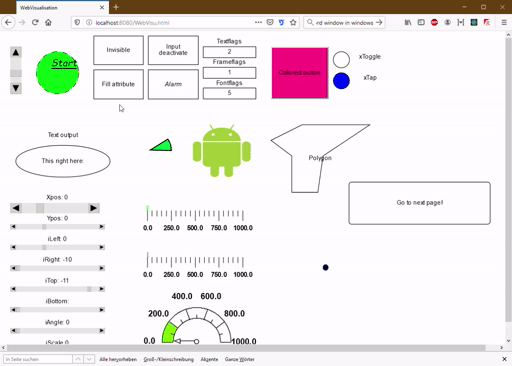

# WebVisu

## Introduction

This is a single page application (SPA) for displaying the web visualisation pages build with the **CoDeSys 2.3** or **WAGO-I/O-PRO CAA** IDE without using Java. With this solution it's possible to display the existing visualisations on mobile devices or modern browsers that doesn't support Java applets anymore.

> :point_right: : Every release has been tested with bigger CoDeSys projects but the components are currently not automatically tested. Create an issue or send me a mail to \_tristan.nentwig+webvisu@gmail.com* if you encounter a problem.

## How to use

Just copy the webvisu.html and webvisu.js from the release tab to the folder which contents are deployed by the webserver. **The webvisu folder path depend on which WAGO PLC is used**. The FTP transfer could be made with FileZilla for example.

For displaying on client use a modern browser like Chrome, Firefox or Edge that supports ES6 constructs.

#### For the non Linux PLCs (like 750-88x, 750-89x series):

Transfer them to the _/PLC_ folder. The visualisation is available afterwards on  
_http://\<ip-address-of-your-plc>/PLC/webvisu.html_

#### For the Linux PLCs (like IPC or PFC200):

Transfer it to _/home/codesys_. The visualisation is available afterwards on  
_http://\<ip-address-of-your-plc>:8080/webvisu.html_ (IPC)
_http://\<ip-address-of-your-plc>/webvisu/webvisu.html_ (PFC200)

## How it works

This SPA is based on the [React](https://github.com/facebook/react) and [MobX](https://github.com/mobxjs/mobx) framework. CoDeSys creates a XML description file for every user generated visualisation. Every file descripes the look and behavior of the objects shown in the specific visualisation. Besides that the file contains the used variables (e.g. "_.xToggleColor_") and their addresses on the web interface.  
The SPA parse the current visualisation XML file and insert a React component dynamically to the React-Dom as absolut positioned element. The variables depending on the element will be included to a singleton object named "ComSocket". This object saves the variables in a observable map and queries the value of the variables cyclic. If an observable value changes all dependend elements rerender. The observable map is part of the MobX framework.

## Demo (1.0.9)

 

## Currently supported features

The WebVisu-SPA is still in progress but already contains numerous functionalities and elements.

| Element/ Function    |     Integrated     |
| -------------------- | :----------------: |
| Change userlevel     | :heavy_check_mark: |
| Rectangle            | :heavy_check_mark: |
| Roundrect            | :heavy_check_mark: |
| Ellipse              | :heavy_check_mark: |
| Polygon              | :heavy_check_mark: |
| Bezier               | :heavy_check_mark: |
| Polyline             | :heavy_check_mark: |
| Sector               | :heavy_check_mark: |
| Bitmap1   | :heavy_check_mark: |
| Subvisualisation     | :heavy_check_mark: |
| Button               | :heavy_check_mark: |
| WMF-File             | :heavy_check_mark: |
| Table                |      :wrench:      |
| Alarm table          | :heavy_minus_sign: |
| Slider2   | :heavy_check_mark: |
| Button               | :heavy_check_mark: |
| Gauge                | :heavy_check_mark: |
| Bar display          | :heavy_check_mark: |
| Histogram            | :heavy_minus_sign: |
| CurrentVisu-Variable | :heavy_check_mark: |
| Language switching   | :heavy_minus_sign: |
| ActiveX-Element      |    :collision:     |

## Meaning of the marks

:heavy_check_mark: : Fully implemented  
:heavy_minus_sign: : Currently not supported  
:wrench: : Currently in progress  
:collision: : Is no longer supported in modern browsers

## Comments

1 : The "Background transparent" (select a specific color to become transparent) doesn't work.
2 : Works fine with Firefox. Sliderchange has to be throttled on Chrome in the future.

## Dependencies

## - Dependencies

|        Package      |         Main        |         Dev         |         npm         |
| ------------------- | ------------------- | ------------------- | ------------------- |
|  |     |     |     |
| (https://img.shields.io/badge/-idb--keyval-gray)            |            |            |            |
| (https://img.shields.io/badge/-jszip-gray)                  |                 |                 |                 |
| (https://img.shields.io/badge/-mobx-gray)                   |                  |                  |                  |
| (https://img.shields.io/badge/-mobx--react-gray)            |            |            |            |
| (https://img.shields.io/badge/-mobx--react--lite-gray)      |       |       |       |
| (https://img.shields.io/badge/-react-gray)                  |                 |                 |                 |
| (https://img.shields.io/badge/-react--dom-gray)             |             |             |             |
| (https://img.shields.io/badge/-react--error--boundary-gray) |  |  |  |
| (https://img.shields.io/badge/-react--hooks-gray)           |           |           |           |
| (https://img.shields.io/badge/-react--uid-gray)             |             |             |             |
| (https://img.shields.io/badge/-reactjs--popup-gray)         |         |         |         |
| (https://img.shields.io/badge/-sprintf--js-gray)            |            |            |            |

    "devDependencies": {
        "@types/react": "^16.9.53",
        "@types/react-dom": "^16.9.8",
        "@types/sprintf-js": "^1.1.2",
        "@typescript-eslint/eslint-plugin": "^4.6.0",
        "@typescript-eslint/parser": "^4.6.0",
        "css-loader": "^4.3.0",
        "eslint": "^7.12.1",
        "eslint-config-prettier": "^6.14.0",
        "eslint-loader": "^4.0.2",
        "eslint-plugin-prettier": "^3.1.4",
        "eslint-plugin-react-hooks": "^4.2.0",
        "html-webpack-plugin": "^4.5.0",
        "prettier": "^2.1.2",
        "source-map-loader": "^1.1.1",
        "style-loader": "^1.3.0",
        "ts-loader": "^8.0.7",
        "typescript": "^4.0.5",
        "webpack": "^4.44.2",
        "webpack-cli": "^3.3.12"
    },
  

